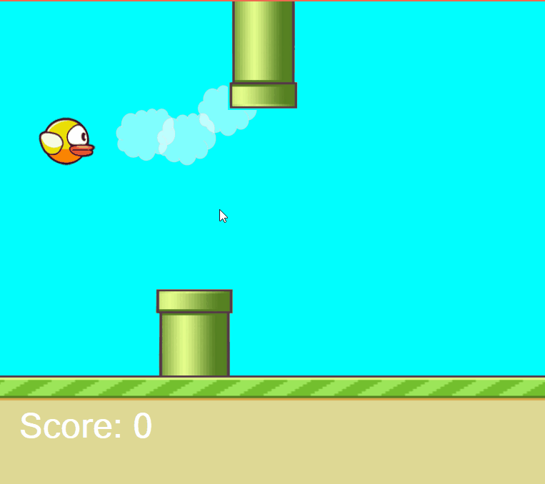

# FlappyBird-CSharp
A small program emulating the popular Flappy Bird game written in C#. The game includes moving pipes and clouds.  
Flappy Bird with gravity set. All based on the timmer event. 

# C# Fundamentals
Focuses on partial class, not quite abstract inheritance. Demonstrates the use of private access modifiers with methods (encapsulation).  
Demonstrates conditional programing through use of if statements. 

# Completed Project

# Installation 

Fork repo to Visual Studio 2019 

Ensure at least these namespaces are used. If not, you can download them from Nuget Package Manager

using System;  
using System.Collections.Generic;  
using System.ComponentModel;  
using System.Data;  
using System.Drawing;  
using System.Linq;  
using System.Text;  
using System.Threading.Tasks;  
using System.Windows.Forms;  
using System.Media;  
